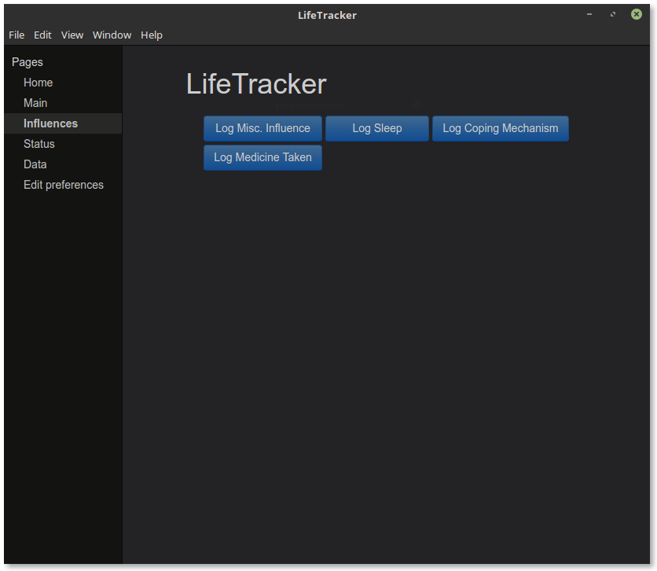
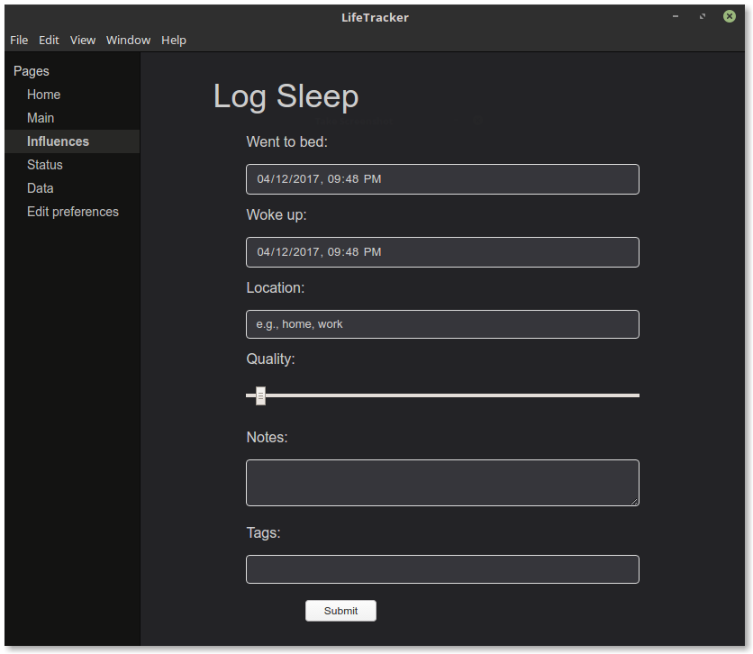

# LifeTracker

> Keep track of events and trends in your life.

This project is largely a learning experience, and so it will develop as my
skills develop, and it will not always be clean or elegant. But I've also been
excited about this project for a long time, and so I do plan to keep working on
it and see where it can go.

## What is it?

Our lives are filled with a ton of data, and it can be hard to keep it all in
mind and make sense of it.

LifeTracker is an app that lets you track all kinds of things in your life. Log
what you're doing, how well you slept last night, how you're feeling, what
you've eaten, anything you want.

Then, you can export your data and start asking questions: How well do you feel
on days when you eat breakfast compared to when you don't? At what time of day
do you work best? How much is your energy affected by X, Y, and Z?

Whether you're tracking out of simple curiosity, to increase your productivity,
to manage your health, or any other reason, my hope is that LifeTracker can
help make the patterns clearer and give you better control over your life.

## How does it work?

Here is a basic overview, but LifeTracker is designed to be flexible and modifiable,
so you can really use it in whatever way works best for you.

First, pick which kind of entry you want to log.



>Image of a window showing the "Infuences" page of LifeTracker. The page header
says "LifeTracker," and below it are four blue buttons: three in the first row,
and one in the second. The buttons are labeled "Log Misc. Influence," "Log
Sleep," "Log Coping Mechanism," and "Log Medicine Taken." On the left is
a naviagation bar. Its header says "Pages." Below it are links labeled "Home,"
"Main," "Influences," "Status," "Data," and "Edit preferences." The
"Influences" link is highlighted.



>Image of the "Log Sleep" form. From top to bottom, the fields are: a date-time
field labeled "Went to bed" showing the default time, a date-time field labeled
"Woke up" showing the default time, a text field labeled "Location" showing the
default hint "e.g., home, work," a slider labeled "Quality" set to zero,
a blank text area labeled "Notes," and a blank text field labeled "Tags." At the
bottom, there is a button that says "Submit."

## Installation

Binaries are coming soon! In the meantime, it will need to be built from source. Requires node.js and npm.

Download the repository from the green "Clone or Download" button, or clone via command line:

```sh
git clone http://github.com/cranndarach/lifetracker-electron.git
```

Extract the `.zip` or `.tar.gz` if you downloaded it via the button. If you're un-tarring via command line, that's:

```sh
cd [directory/containing/tarball]
tar -xvf lifetracker-electron.tar.gz
```

Next, `cd` into the directory containing the project, and install via npm:

```sh
cd lifetracker-electron
npm install
```

If you are happy to run it from the command line, skip to the next section. If you want to build an executable yourself, run the following:

```sh
npm run-script build-[platform]
```

where `[platform]` is one of `win`, `mac`, or `linux`. Then you'll find the executable in the `dist/` folder. (The executable will be called something like `Lifetracker` or `Lifetracker.exe`.) **Note: This has only been tested for Windows 10 and Linux Mint 18.** If it doesn't work for you, you may need to just run it from command line (or, if you fix the script, you could submit a pull request!).

## Run the app

If you didn't build an executable, then once you have successfully run `npm install`, run:

```sh
npm start
```

to start the program!

## To-do

* More options for viewing, manipulating, and analyzing data.
  * Contributions are encouraged here. It doesn't even have to be part of the
  app itself. If you have an R script that you use to analyze your data, for
  example, please share it! Maybe we could even make an awesome-lifetracker
  repository for community-submitted data utilities.
* The UI theme is evolving bit by bit. More themes are definitely needed.
* Easier manipulation/creation of entry forms.
* A way to edit past entries in-app.
* A way to see all prevously-entered categories when writing an entry.

## Contributing

Contributions are welcome, though specific information about contributing will
become available as the project develops (and, since I'm new at this, I am not
sure how long that will be). If you are interested in contributing in the
meantime, please don't hesitate to submit an issue with any questions, or just
go ahead and fork it and submit a pull request if you're feeling adventurous.
Doing so will probably help me understand by doing what kinds of information
I will need to facilitate further contributions.

Beginners are definitely welcome---this project is a learning experience for
me, so it makes sense for it to also be a learning experience for anyone!

## License info

Copyright © 2016-2017 R Steiner, licenced under the terms of the [MIT
license](https://github.com/cranndarach/lifetracker-electron/blob/master/LICENSE).
The structure of `index.js` is adapted from
[Bozon](https://github.com/railsware/bozon), © Alex Chaplinsky, MIT Licence.
