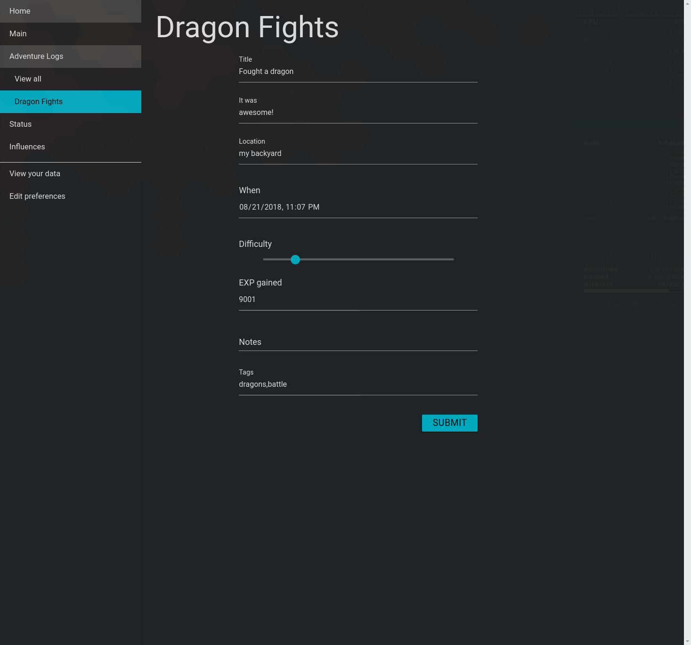

# LifeTracker

> Keep track of events and trends in your life.

[](https://nodei.co/npm/lifetracker/)

This project is largely a learning experience, and so it will develop as my
skills develop, and it will not always be clean or elegant. But I've also been
excited about this project for a long time, and so I do plan to keep working on
it and see where it can go.

## What is it?

Our lives are filled with a ton of data, and it can be hard to keep it all in
mind and make sense of it.

LifeTracker is an app that lets you track all kinds of things in your life. Log
what you're doing, how well you slept last night, how you're feeling, what
you've eaten, anything you want.

Then, you can export your data and start asking questions: How well do you feel
on days when you eat breakfast compared to when you don't? At what time of day
do you work best? How much is your energy affected by X, Y, and Z?

Whether you're tracking out of simple curiosity, to increase your productivity,
to manage your health, or any other reason, my hope is that LifeTracker can
help make the patterns clearer and give you better control over your life.

## How does it work?

Here is a basic overview, but LifeTracker is designed to be flexible and
modifiable, so you can really use it in whatever way works best for you (see
the [wiki](https://github.com/cranndarach/lifetracker/wiki) for tips).

First, pick which kind of entry you want to log.


>Image of a window showing the "Main" page of LifeTracker. The page header
says "Main," and below it are four blue buttons: three in the first row, and one in the second. The buttons are labeled "Log an Event," "Log a Task," "Add EXP
Gained," and "Log a Simple Entry."



>Screenshot of the "Dragon Fights" entry, filled in.

Then, fill in whatever fields you want. You can leave anything blank if you don't
feel like answering it or don't think it would be helpful.

You can go explore or export your data whenever you want.


>Screenshot of the "Data" page. The data from three entries are arranged in a table, one per row.

## Installation

**Please note that LifeTracker is still in active development.** I want it to
be available to you, but there will definitely be some bugs, as well as some
not-yet-implemented features. Check back for updates once in a while, feel free
to submit issues with bugs or feature requests, and *please keep a backup of
your data.*

### Standalone version

Go to the [Releases](https://github.com/cranndarach/lifetracker/releases) tab and download the version for your OS. Unzip
it and run the file called `Lifetracker` or `Lifetracker.exe`.

### From npm

Requires node.js and npm.

Run:

```sh
npm install --global lifetracker
```

Then run by entering

```sh
lifetracker
```
into your terminal or command prompt.

### From source

Requires node.js and npm.

Download the repository from the green "Clone or Download" button, or clone via
command line:

```sh
git clone http://github.com/cranndarach/lifetracker.git
```

Extract the `.zip` or `.tar.gz` if you downloaded it via the button. If you're
un-tarring via command line, that's:

```sh
cd [directory/containing/tar]
tar -xvf lifetracker.tar.gz
```

or unzipping:

```sh
cd [directory/containing/zip]
unzip lifetracker.zip
```

Next, `cd` (change directories) into the directory containing the project, and
install via npm:

```sh
cd lifetracker
npm install
```

If you are happy to run it from the command line, then once you have
successfully run `npm install`, run:

```sh
npm start
```

to start the program!

If you'd prefer to build an executable yourself, run the following:

```sh
npm run build-[platform]
```

where `[platform]` is one of `win`, `mac`, or `linux`. Then you'll find the
executable in the `dist/` folder. (The executable will be called something like
`Lifetracker` or `Lifetracker.exe`.)

## To-do

* More options for viewing, manipulating, and analyzing data.
  * Contributions are encouraged here. It doesn't even have to be part of the
  app itself. If you have an R script that you use to analyze your data, for
  example, please share it! Maybe we could even make an awesome-lifetracker
  repository for community-submitted data utilities.
* The UI theme is evolving bit by bit. More themes are definitely needed.
* Easier manipulation/creation of entry forms.
* A way to edit past entries in-app.

## Contributing

Part of what's exciting about LifeTracker is how much room there is for
customization. If you develop a feature, make tweaks to the UI or add a whole
new theme, or make any changes that you think should be part of the main
project, please submit a pull request! If you make some changes that are more
tailored to you, but that you'd like to share anyway, consider adding it to the
[Show off your style](https://github.com/cranndarach/lifetracker/wiki/Show-off-your-style) wiki page.

Beginners are definitely welcome---this project is a learning experience for
me, so it makes sense for it to also be a learning experience for anyone! If
you're looking for a place to get started, check out the ["great-for-beginners"
issues
label](https://github.com/cranndarach/lifetracker/issues?q=is%3Aissue+is%3Aopen+label%3Agreat-for-beginners)

## License info

Copyright © 2016-2018 R Steiner, licenced under the terms of the [MIT
license](https://github.com/cranndarach/lifetracker/blob/master/LICENSE).
